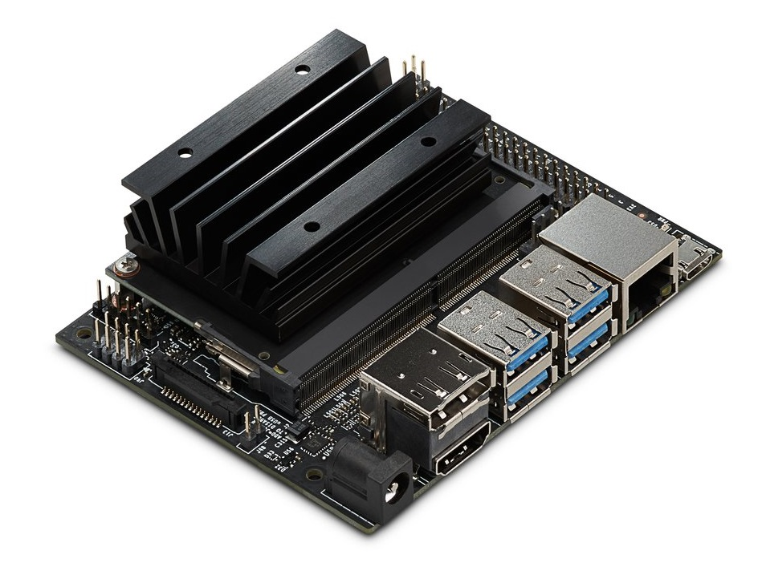

# Real-Time Object Detection
Object detection and tracking in PyTorch

## Project Overview
The purpose of this project is to:

* Object Detection in images.

* Object Tracking In Videos. 

* Run inference on the Jetson Nano.

  
 

## Licence
This project is licensed under the terms of the 
